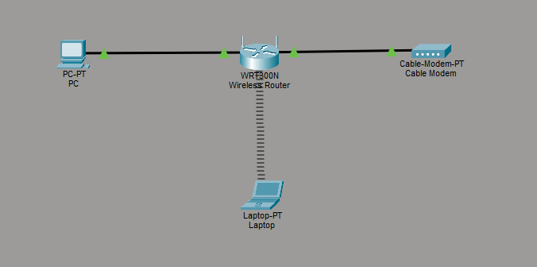

# Create a Simple Home Network

## Lab Overview

This lab demonstrates the setup of a basic home network using Cisco Packet Tracer, including wired and wireless connectivity between devices.

## What I did

- Built a simple home network topology in Cisco Packet Tracer
- Connected a PC to a wireless router using an Ethernet cable
- Connected a laptop to the network using Wi-Fi (WRT300N)
- Used DHCP to automatically assign IP addresses to devices
- Tested connectivity between devices using ping

## Topology

## Key Concepts

- DHCP (Dynamic Host Configuration Protocol)
- LAN (Local Area Network)
- Wireless networking (Wi-Fi)
- Basic network connectivity and testing

## Tools Used

- Cisco Packet Tracer

## Outcome

Successfully established communication between wired and wireless devices in a simulated home network environment.
