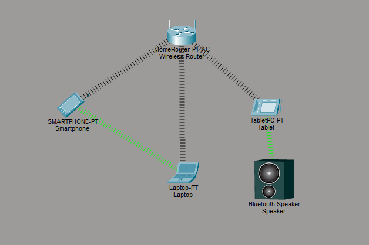

# Wireless Networking and Bluetooth Lab (Cisco Packet Tracer)

## Lab Overview

This lab demonstrates the configuration of a simple wireless network using Cisco Packet Tracer. It includes Wi-Fi connectivity, DHCP-based IP assignment, and Bluetooth communication between devices in a simulated environment.

## Network Setup

The lab includes the following devices:

- Wireless Router (WRT300N)
- PC (wired connection)
- Laptop (wireless connection via Wi-Fi)
- Tablet (Bluetooth-enabled device)
- Bluetooth Speaker

## What I Did

- Built a wireless LAN using a WRT300N router
- Configured SSID and secured Wi-Fi access using WPA2
- Connected a PC using Ethernet (wired connection)
- Connected a laptop to the wireless network using Wi-Fi
- Enabled DHCP for automatic IP address assignment
- Configured Bluetooth communication between a tablet and speaker
- Verified connectivity between all devices within the local network

## Key Concepts

- WLAN (Wireless Local Area Network)
- DHCP (Dynamic Host Configuration Protocol)
- Wi-Fi security (WPA2)
- Bluetooth pairing and communication
- Basic LAN connectivity

# Topology

## Verification

- Checked IP address assignment using DHCP
- Verified Wi-Fi connection from laptop to router
- Confirmed wired connectivity for PC
- Successfully paired and tested Bluetooth devices
- Ensured communication within the local network

## Tools Used

- Cisco Packet Tracer

## Outcome

Completed configuration of a basic wireless and Bluetooth-enabled network and verified successful communication between end devices in a simulated environment.
